# Project Name
>Content Management System 

## Table of contents
* [General info](#general-info)
* [Screenshots](#screenshots)
* [Technologies](#technologies)
* [Requirements](#requirements)
* [Installation](#installtion)
* [Setup](#setup)
* [Features](#features)
* [Status](#status)
* [Inspiration](#inspiration)
* [Contact](#contact)

## General info
This is a : Content Management System like WordPress, Drupal or Joomla Using PHP.

## Screenshots
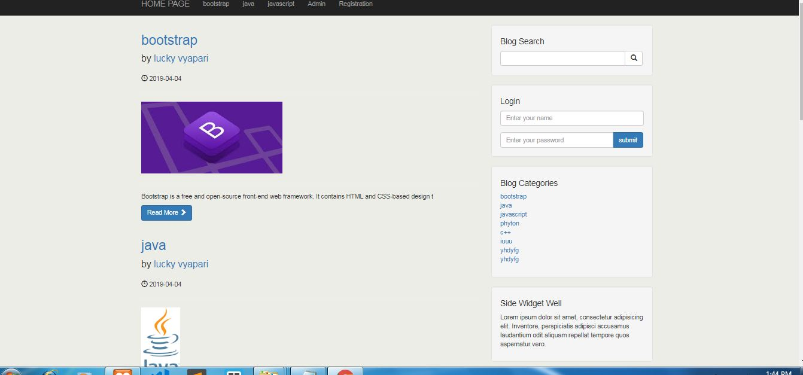
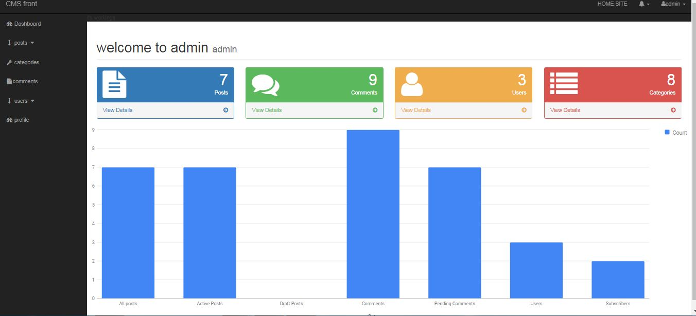
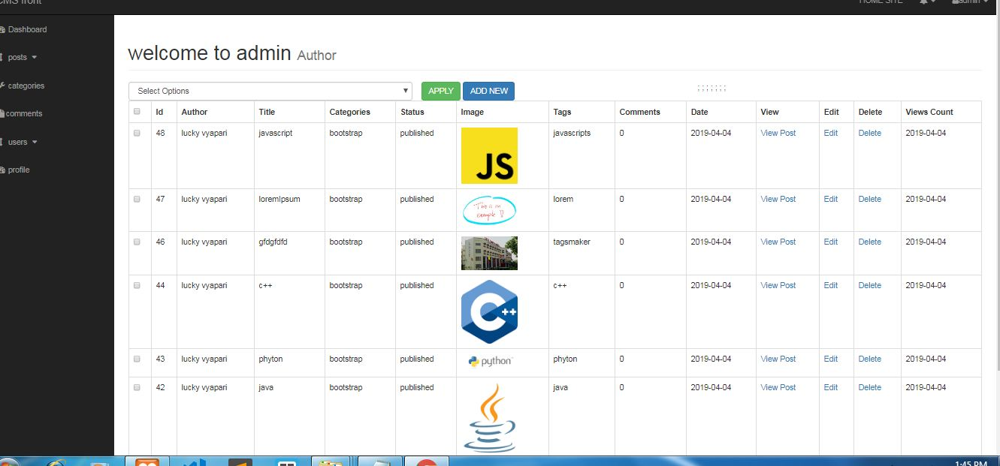
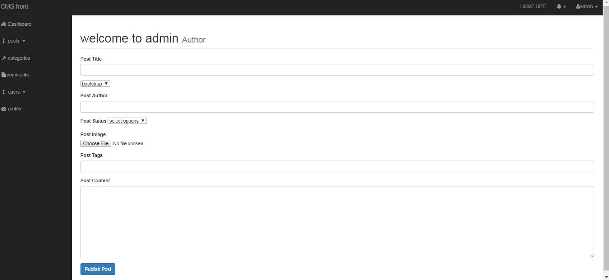
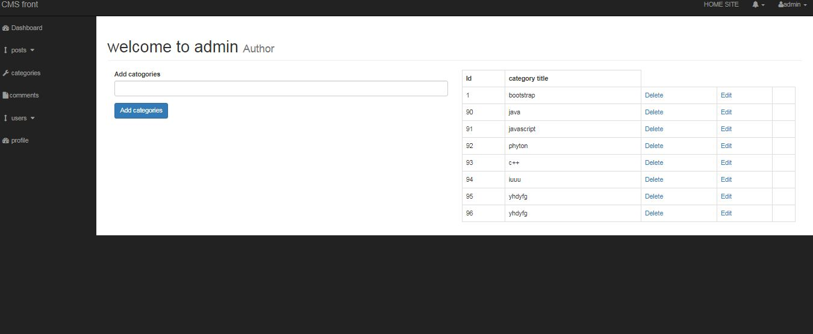
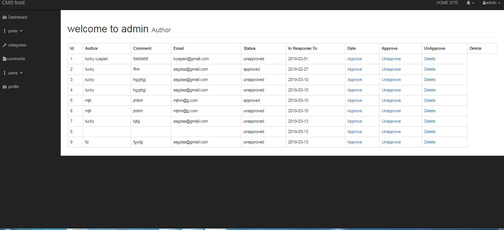
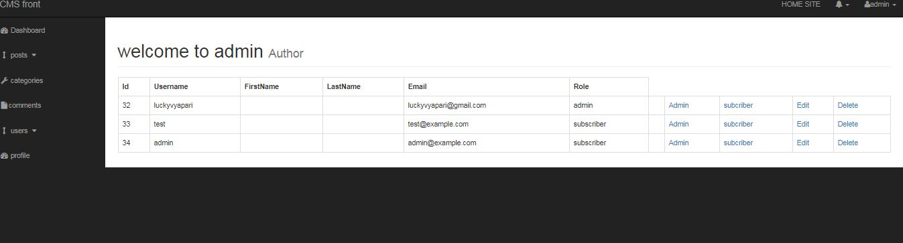
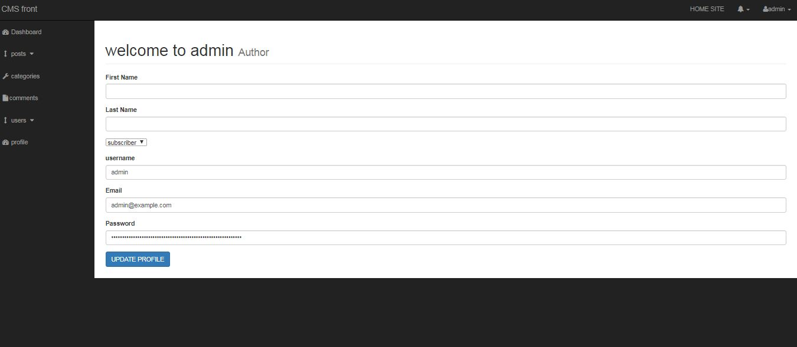
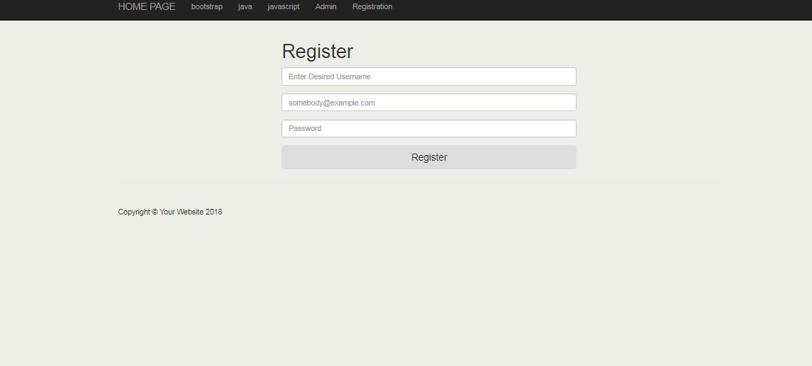
## Technologies
* Tech 1 - php.
* Tech 2 - bootstrap
* Tech 3 - html.
* Tech 1 - css.
* Tech 2 - javascript.

## Requirements
Before starting to install our item, make sure you fulfill the following requirements:

* PHP Version >= 7.0
* MySQL Version >= 5.6
* GD Library Enabled
* mod_rewrite Enabled
* CURL Module Active
* allow_url_fopen Enabled
* file_get_contents Enabled
* Php Exec Enabled

##  Installation

In order to install the login system , please follow these steps:

1. Search for the folder SOURCE_CODE in the main script folder that you have downloaded.
2. Now upload the SOURCE_CODE folder into your server using FTP or in Localhost(I have used XAMPP).
3. Create mysql database using cpanel or your hosting provider's system or in localhost. Then import the awzpact_db.sql file (that you got into the script's DATABASE folder) into your created database.
4. Now you will have to setup the config and database file. If you are familier with codeigniter, you should know about it. But don't worry! I will tell step by step.
5. Go to the SOURCE_CODE folder, then application and then config folder.
6.You will get two files config.php and database.php

7. Open up these files with any text editor (for example: notepad++).
8.In config.php file, make these changes:
9. Change the indicated values of photos like this

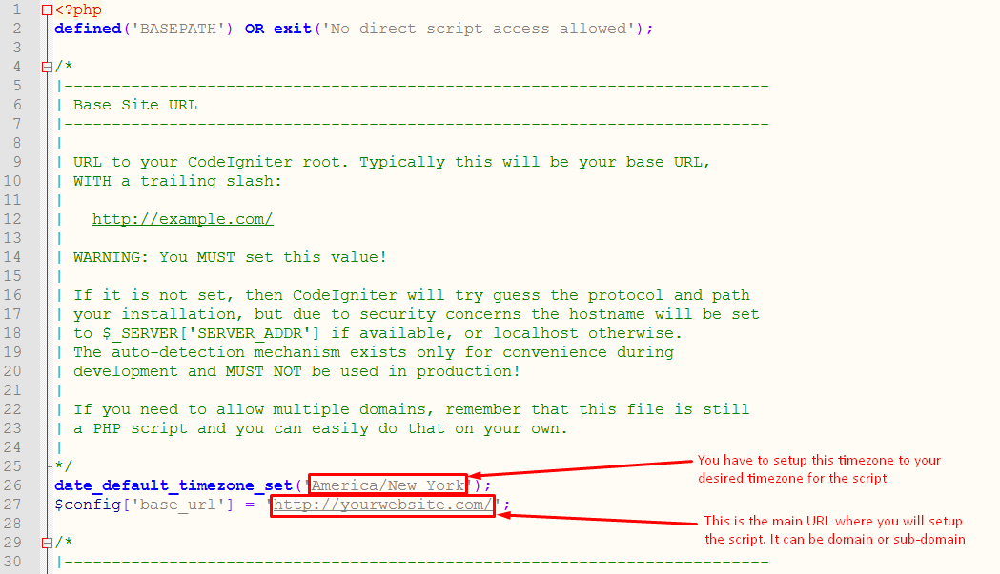

10. In database.php file, make these changes:
11. Change the indicated values of photos like this:

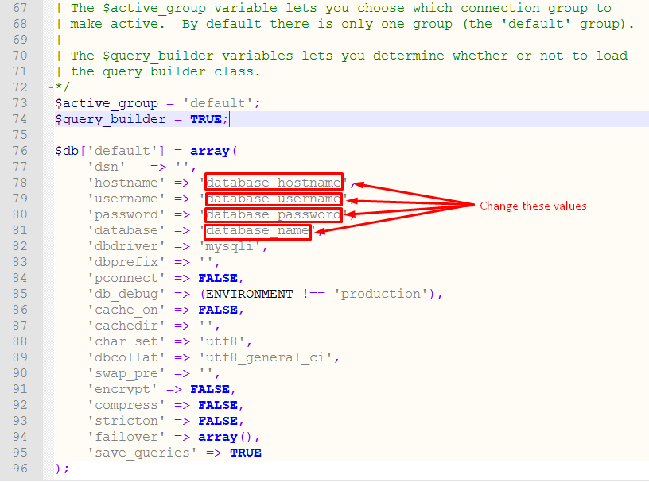

12.NOTE -Don’t Forget To create a database and import sql file to run.

Login Admin      Username : admin
                 Password :  123456

## Features
List of features ready and TODOs for future development
* cms like wordpress

*** Details of admin page***

* ADMIN can see allpost,active post,draft post,comment,spending comments,users subcriber in GRAPHICAL INTERFACE and track from dashboard.

* ADMIN see all posts.
* ADMIN can edit or delete posts.
* ADMIN can make post  publish,draft,clone.
* when admin login can directly go to webpage and edit the post.
* post can be put in categories wise.

* ADMIN add categories.
* ADMIN see all categories.
* ADMIN can edit or modify categories.
* ADMIN can delete categories

* ADMIN see all comments on blog.
* ADMIN can approve or unapprove comments.
* ADMIN can delete comments.

* ADMIN see all users.
* ADMIN can make users admin or subcriber.
* ADMIN can delete or edit user.
* ADMIN can add users.

* ADMIN can edit and modify own profile.

*****ADMIN features****
* ADMIN can add college name and location.
* ADMIN can add co-admin.
* ADMIN can view all co-admins
* ADMIN can add students.
* ADMIN can add college name and location.
* ADMIN can see details of students.
* ADMIN can edit the details of students.
* ADMIN can delete the details of students.

*** Details of front-end***

*  Its responsive web page work on any sceeen like mobile,pc,tablets etc.
* users canlog in too.
* users can comment on post
* users can search on webpage by using search option.
* user can see page according to catrgories.

To-do list:
* many things could be added in features

## Status
Project is:  _finished.

## Inspiration
Project inspired by udemy course, based on Content Management System

## Contact
Created by LUCKY VYAPARI - feel free to contact me!
***It is a zip folder, for see the source code you should download it.***

Thanks from ***LUCKY VYAPARI.***
